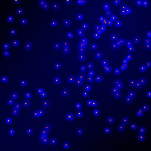
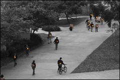

# Objects counting by estimating a density map with convolutional neural networks

The PyTorch implementation of https://github.com/WeidiXie/cell_counting_v2.

More details about the method can be found in [our blog post](https://neurosys.com/article/objects-counting-by-estimating-a-density-map-with-convolutional-neural-networks/).

## Data preparation

Three datasets are considered:

* `cell`: [Fluorescent cells dataset](http://www.robots.ox.ac.uk/~vgg/research/counting/index_org.html)
* `shrimp`: [shrimp dataset](https://tuc.cloud/index.php/s/ZTB4WpfJH9meMJb/download/shrimpdataset.zip)
* `ucsd`: [UCSD pedestrians dataset](http://www.svcl.ucsd.edu/projects/peoplecnt/)

One can get them using `get_data.py` script:

```
Usage: get_data.py [OPTIONS]

  Get chosen dataset and generate HDF5 files with training and validation samples.

Options:
  --dataset [cell|shrimp|ucsd]  [required]
  --help                      Show this message and exit.
```

The script download original data and preprocess it to create HDF5 files with images and labels (corresponding density maps).

## Training

Two network architectures are available so far:

* U-Net

    Ronneberger, Olaf, Philipp Fischer, and Thomas Brox. "U-net: Convolutional networks for biomedical image segmentation." In International Conference on Medical image computing and computer-assisted intervention, pp. 234-241. Springer, Cham, 2015.

* FCRN-A

    Weidi, Xie, J. Alison Noble, and Andrew Zisserman. "Microscopy cell counting with fully convolutional regression networks." In 1st Deep Learning Workshop, Medical Image Computing and Computer-Assisted Intervention (MICCAI). 2015.

One can use `train.py` script to train chosen network on selected dataset:

```
Usage: train.py [OPTIONS]

  Train chosen model on selected dataset.

Options:
  -d, --dataset_name [cell|shrimp|ucsd]
                                  Dataset to train model on (expect proper
                                  HDF5 files).  [required]
  -n, --network_architecture [UNet|FCRN_A]
                                  Model to train.  [required]
  -lr, --learning_rate FLOAT      Initial learning rate (lr_scheduler is
                                  applied).
  -e, --epochs INTEGER            Number of training epochs.
  --batch_size INTEGER            Batch size for both training and validation
                                  dataloaders.
  -hf, --horizontal_flip FLOAT    The probability of horizontal flip for
                                  training dataset.
  -vf, --vertical_flip FLOAT      The probability of horizontal flip for
                                  validation dataset.
  --unet_filters INTEGER          Number of filters for U-Net convolutional
                                  layers.
  --convolutions INTEGER          Number of layers in a convolutional block.
  --plot                          Generate a live plot.
  --help                          Show this message and exit.
```

## Inference

The `infer.py` script is provided to run a model on a given input image.

```
Usage: infer.py [OPTIONS]

  Run inference for a single image.

Options:
  -i, --image_path FILENAME       A path to an input image.  [required]
  -n, --network_architecture [UNet|FCRN_A]
                                  Model architecture.  [required]
  -c, --checkpoint FILENAME       A path to a checkpoint with weights.
                                  [required]

  --unet_filters INTEGER          Number of filters for U-Net convolutional
                                  layers.

  --convolutions INTEGER          Number of layers in a convolutional block.
  --one_channel                   Turn this on for one channel images
                                  (required for ucsd).

  --pad                           Turn on padding for input image (required
                                  for ucsd).

  --visualize                     Visualize predicted density map.
  --help                          Show this message and exit.
```

### Examples

```
$ python infer.py -n UNet -c cell_UNet.pth -i ../data/cells/001cell.png --visualize                                    
The number of objects found: 134.857265625
```



```
python infer.py -n UNet -c shrimp_UNet.pth -i ../data/shrimp_dataset/frames/seq_000001.jpg --visualize                                    
The number of objects found: 30.82901123046875
```


```
python infer.py -n UNet -c ucsd_UNet.pth -i ../data/ucsdpeds/vidf/vidf1_33_000.y/vidf1_33_000_f001.png --pad --one_channel --visualize
The number of objects found: 18.083719482421873
```



## Requirements

To install required python packages run: `pip3 install -r requirements.txt`.

---

If you are interested in ML/DL methods, check out [our blog](https://neurosys.com/blog/category/rd/#blog-posts-blog-list) for more articles.
